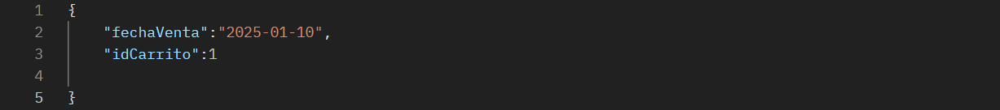
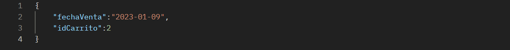

<h1 align="center"> Proyecto Tienda de Electrodomésticos con Microservicos </h1>

## Descripción del Proyecto:

Este es un proyecto basado en microservicios, desarrollado en Java, que simula una tienda de electrodomésticos en línea. La arquitectura se compone de tres microservicios principales: Producto, Carrito de Compras, y Ventas. Utiliza Spring Boot para la creación de microservicios, con funcionalidades como descubrimiento de servicios, enrutamiento, balanceo de carga, tolerancia a fallos y centralización de configuraciones.

## Funcionalidades Principales:

### Microservicio de Productos

 - Gestiona la información de los electrodomésticos disponibles.
 - Permite listar los productos con detalles como: código, nombre, marca y precio.

### Microservicio de Carrito de Compras

- Permite crear y gestionar carritos de compras.
- Los usuarios pueden agregar y quitar productos del carrito.
- Calcula automáticamente el precio total del carrito, gracias a la consulta del microservicio Productos.

### Microservicio de Ventas

- Registra las ventas realizadas, asociándolas con carritos de compras.
- Cada venta tiene un identificador único y una fecha.
- La venta consulta el carrito para obtener el monto total y los productos incluidos.

## Arquitectura del proyecto:

- **Java y Spring Boot:** Plataforma para desarrollar los microservicios.
- **Eureka Server y API Gateway:** Para descubrimiento de servicios y gestión de enrutamiento.
- **Feign Client:** Para la comunicación entre microservicios.
- **Resilience4j (circuit breaker y retry):** Estrategias de tolerancia a fallos.
- **Load Balancer:** Para distribuir la carga entre los microservicios.
- **Config Server:** Para centralizar la gestión de configuraciones.

## Dependencias Clave:

- _**Maven:**_ Gestión de dependencias y construcción del proyecto.
- _**Lombok:**_ Para reducir el boilerplate code en entidades y DTOs.
- _**JPA + Hibernate:**_ Para la persistencia de datos en MySQL.
- _**Spring Web:**_ Para la creación de APIs RESTful.
- _**Base de Datos:**_ MySQL, ejecutado mediante **XAMPP** para la gestión y almacenamiento de datos.
- _**Postman:**_ Para pruebas de los endpoints.
- _**Docker:**_ Para la simulación de despliegue y contenedores.

## Endpoints del Proyecto:

#### Nota:

Todos los servicios están gestionados a través de un <strong>API Gateway</strong> que se ejecuta en <code>localhost:444</code>. Las URLs para interactuar con los microservicios siguen la siguiente estructura:

`localhost:444/{nombre-del-microservicio}/{endpoint}`

donde `{nombre-del-microservicio}` puede ser:
- `producto-service` para el microservicio de productos.
- `carrito-service` para el microservicio de carrito de compras.
- `ventas-service` para el microservicio de ventas.
- `config-server` para entrar al config-server del sistema.

### Config Server:
- `GET` /config-server/{service}/default

  - **Descripción:** Obtiene la configuración del servicio especificado (por ejemplo, `carrito-service`).
  - **Ejemplo de URL:** `localhost:444/config-server/carrito-service/default`

### Microservicio de Producto:
1. `POST` /producto-service/productos/crear
- **Descripción:** Crea un nuevo producto en la tienda.
- **Body:**

- **Ejemplo de URL:** `localhost:444/producto-service/productos/crear`

2. `GET` /producto-service/productos/traer
- **Descripción:** Obtiene todos los productos disponibles en la tienda.
- **Ejemplo de URL:** `localhost:444/producto-service/productos/traer`

3. `GET` /producto-service/productos/traer/{id}

- **Descripción:** Obtiene los detalles de un producto específico mediante su código.
- **Ejemplo de URL:** `localhost:444/producto-service/productos/traer/1` _(Reemplaza el "1" por el código del producto deseado)_

4. `PUT` /producto-service/productos/editar/{id}

- **Descripción:** Edita los detalles de un producto existente.
- **Body:**

- **Ejemplo de URL:** `localhost:444/producto-service/productos/editar/1` _(Reemplaza el "1" por el ID del producto)_

5. `DELETE` /producto-service/productos/borrar/{id}

- **Descripción:** Elimina un producto de la tienda mediante su ID.
- **Ejemplo de URL:** `localhost:444/producto-service/productos/borrar/1` _(Reemplaza el "1" por el ID del producto)_

### Microservicio de Carrito:

1. `POST` /carrito-service/carrito/crear

- **Descripción:** Crea un carrito de compras con los productos seleccionados.
- **Body:**

- **Ejemplo de URL:** `localhost:444/carrito-service/carrito/crear`

2. `GET` /carrito-service/carrito/traer-todos

- **Descripción:** Obtiene todos los carritos de compras.
- **Ejemplo de URL:** `localhost:444/carrito-service/carrito/traer-todos`

3. `GET`/carrito-service/carrito/traer/{id}

- **Descripción:** Obtiene un carrito específico mediante su ID.
- **Ejemplo de URL:** `localhost:444/carrito-service/carrito/traer/2` _(Reemplaza el "2" por el ID del carrito)_

4. `PUT` /carrito-service/carrito/editar/{id}

- **Descripción:** Edita un carrito de compras existente.
- **Body:**

- **Ejemplo de URL:** `localhost:444/carrito-service/carrito/editar/1` _(Reemplaza el "1" por el ID del carrito)_

5. `DELETE` /carrito-service/carrito/borrar/{id}

- **Descripción:** Elimina un carrito de compras mediante su ID.
- **Ejemplo de URL:** `localhost:444/carrito-service/carrito/borrar/1` _(Reemplaza el "1" por el ID del carrito_

###Microservicio de Ventas:

1. `POST` /ventas-service/ventas/crear

- **Descripción:** Crea una nueva venta, asociada a un carrito de compras.
- **Body:**

- **Ejemplo de URL:** `localhost:444/ventas-service/ventas/crear`

2. `GET` /ventas-service/ventas/traer

- **Descripción:** Obtiene todas las ventas realizadas.
- **Ejemplo de URL:** `localhost:444/ventas-service/ventas/traer`

3. `GET` /ventas-service/ventas/traer/{id}

- **Descripción:** Obtiene los detalles de una venta específica mediante su ID.
- **Ejemplo de URL:** `localhost:444/ventas-service/ventas/traer/1` _(Reemplaza el "1" por el ID de la venta)_

4. `PUT` /ventas-service/ventas/editar/{id}

- **Descripción:** Edita una venta existente.
- **Body:**

- **Ejemplo de URL:** `localhost:444/ventas-service/ventas/editar/1` _(Reemplaza el "1" por el ID de la venta)_

5. `DELETE` /ventas-service/ventas/borrar/{id}

- **Descripción:** Elimina una venta mediante su ID.
- **Ejemplo de URL:** `localhost:444/ventas-service/ventas/borrar/1` _(Reemplaza el "1" por el ID de la venta)_

## Detalles Técnicos

- **Escalabilidad:** El proyecto está preparado para escalar horizontalmente utilizando un balanceador de carga.
- **Tolerancia a fallos:** Resilience4j está implementado para manejar caídas en los servicios con estrategias de Circuit Breaker y Retry.
- **Centralización de Configuraciones:** Utilizamos Config Server para centralizar las configuraciones de los microservicios.
